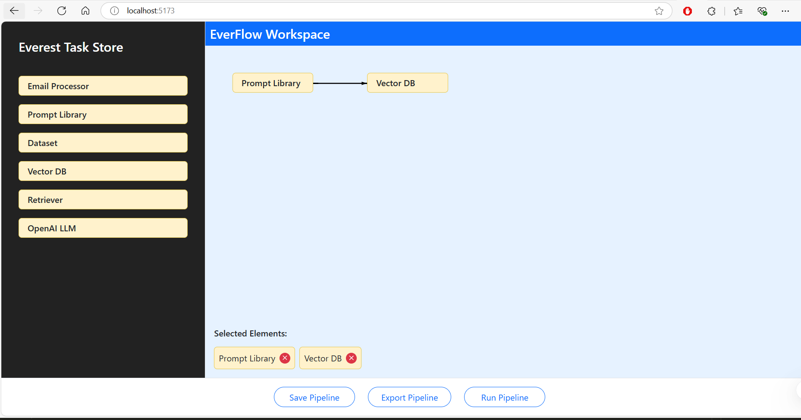

### Project Notes

1. Project Setup

- **Created a new React project** using Vite:
  - npm create vite@latest workflow-builder -- --template react
  - cd workflow-builder
  - npm install react-dnd react-dnd-html5-backend - react-bootstrap bootstrap lucide-react

### Project Structure

- **Installed necessary packages**:
  - `src/App.js` - Main application
  - `src/components/WorkflowBuilder.jsx` - Combined workflow components
  - `src/components/ItemComponents.jsx` - All item-related components
  - `src/utils.jsx` - Constants and utilities



### Step-by-Step Guide: Creating a Drag and Drop Workflow Builder

Here's a simple explanation of how we built the workflow builder application:

## 1. Project Setup

1. **Created a new React project** using Vite:

```javascript
npm create vite@latest workflow-builder -- --template react
```

2. **Installed necessary packages**:

```javascript
npm install react-dnd react-dnd-html5-backend react-bootstrap bootstrap lucide-react

npm run dev
```

3. **Set up file structure** with four main files:

   1. `App.jsx`: Main application entry point
   2. `WorkflowBuilder.jsx`: Main component that manages the application state
   3. `ItemComponents.jsx`: Contains all the UI components
   4. `utils.js`: Contains constants and utility functions

## 2. Setting Up Drag and Drop

1.  **Added DndProvider** in `App.jsx` to enable drag and drop functionality throughout the app.
2.  **Created draggable items** in the left menu using the `useDrag` hook from react-dnd.
3.  **Created a drop zone** (the workspace area) using the `useDrop` hook to accept dropped items.

## 3. Building the Main Components

1.  **Created the layout** with a dark sidebar on the left and the workspace on the right.
2.  **Built the item menu** that displays draggable elements in the left sidebar.
3.  **Built the workspace** that accepts dropped items and displays them.
4.  **Added the selected elements section** at the bottom to show all items in the workspace.
5.  **Created action buttons** at the bottom of the page for Save, Export, and Run actions.

## 4. Managing State and Positioning

1. **Set up state management** in the WorkflowBuilder component:

   1. `workspaceItems`: Array of items in the workspace
   2. `selectedItem`: Currently selected item for editing
   3. `showModal`: Controls visibility of the item configuration modal
   4. `toast`: Controls toast notifications

2. **Implemented automatic positioning** of items:

   1. When an item is dropped, it's added to the workspace
   2. Items are automatically arranged in a horizontal flow
   3. When items reach the edge of the container, they wrap to the next row

3. **Created the arrow connections** between consecutive items:

   1. Arrows are drawn as SVG paths
   2. Different arrow styles for same-row vs different-row connections

## 5. Adding Interactive Features

1.  **Implemented item clicking** to open a configuration modal.
2.  **Created the modal** for adding notes to items.
3.  **Added remove functionality** to delete items from the workspace.
4.  **Added toast notifications** for action button clicks.

## 6. Making It Responsive

1.  **Used Bootstrap's grid system** for responsive layout.
2.  **Added container width detection** to adjust the layout when the window is resized.
3.  **Implemented overflow handling** so users can scroll to see all items if needed.

## 7. Key Concepts Used

1.  **React Hooks**: Used useState, useEffect, useRef for state management and side effects.
2.  **React-DnD**: Used for drag and drop functionality.
3.  **Refs and forwardRef**: Used to access DOM elements and combine refs.
4.  **SVG Drawing**: Used to create the arrows between items.
5.  **Component Composition**: Broke down the UI into reusable components.
6.  **Event Handling**: Implemented click, drag, and drop event handlers.
7.  **Conditional Rendering**: Used to show/hide elements based on state.

## 8. How the Data Flows

1.  **User drags an item** from the left menu.
2.  **Item is dropped** in the workspace area.
3.  **handleAddItem function** creates a new item with a unique ID.
4.  **rearrangeItems function** positions all items in a flow layout.
5.  **Arrows are drawn** between consecutive items.
6.  **User clicks an item** to open the configuration modal.
7.  **User adds a note** and saves it, updating the item's state.
8.  **Selected elements section** shows all items in the workspace.
9.  **User can remove items** by clicking the X button.
